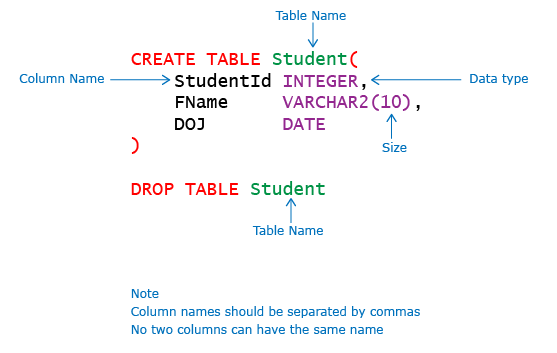

**Create and Drop Table**:

**CREATE TABLE** statement is used to create a table in a database. Database tables are organized into rows and columns. Each table must have a name and can have any number of columns (minimum 1 column is 
required). Each column must have a data type which determines the type of values that can be stored. CREATE TABLE command will fail if a table is already existing in the database with the same name. All tables must 
have a unique name.

**DROP TABLE** statement is used to remove an existing table from the database.

